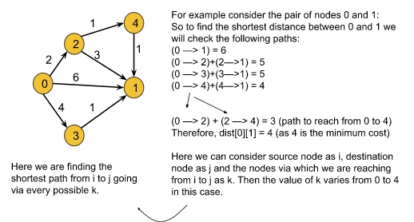
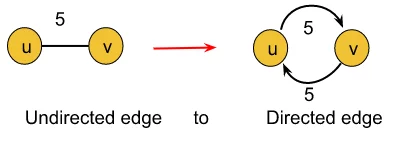

## Floyd Warshall

-   [Visit Problem](https://practice.geeksforgeeks.org/problems/implementing-floyd-warshall2042/1)

**Solution :** 
In this article, we will be discussing Floyd Warshall Algorithm which is very much different from the two which we have previously learned: Dijkstra’s Shortest Path algorithm and the Bellman-Ford algorithm.  

Dijkstra’s Shortest Path algorithm and Bellman-Ford algorithm are single-source shortest path algorithms where we are given a single source node and are asked to find out the shortest path to every other node from that given source. But in the Floyd Warshall algorithm, we need to figure out the shortest distance from each node to every other node.  

Basically, the Floyd Warshall algorithm is a multi-source shortest path algorithm and it helps to detect negative cycles as well. The shortest path between node u and v necessarily means the path(from u to v) for which the sum of the edge weights is minimum.  

In Floyd Warshall’s algorithm, we need to check every possible path going via each possible node. And after checking every possible path, we will figure out the shortest path(a kind of brute force approach to find the shortest path). Let’s understand it using the following illustration:  

  

From the above example we can derive the following formula: 
<b>
matrix[i][j] =min(matrix[i][j], matrix[i ][k]+matrix[k][j]), where i = source node, j = destination node, and k = the node via which we are reaching from i to j.</b>
 

Here we will calculate `dist[i][j]` for every possible node `k (k = 0, 1….V, where V = no. of nodes)`, and will select the minimum value as our result.  

In order to apply this algorithm to an undirected graph, we just need to convert the undirected edges into directed edges like the following:  

 

<b>Explanation :</b> An undirected edge between nodes u and v necessarily means that there are two opposite-directed edges, one towards node u and the other towards node v. So the above conversion is valid.  

**Intuition :** 
The intuition is to check all possible paths between every possible pair of nodes and to choose the shortest one. Checking all possible paths means going via each and every possible node.  

<b> What will happen if we will apply Dijkstra’s algorithm for this purpose ?</b>  

-   f the graph has a negative cycle: We cannot apply Dijkstra’s algorithm to the graph which contains a negative cycle. It will give TLE error in that case.
-   If the graph does not contain a negative cycle: In this case, we will apply Dijkstra’s algorithm for every possible node to make it work like a multi-source shortest path algorithm like Floyd Warshall. The time complexity of Floyd Warshall is O(V3)(Which we will discuss later in this article) whereas if we apply Dijkstra’s algorithm for the same purpose the time complexity reduces to O(V*(E*logV)) (where v = no. of vertices).

**Approach :** 
The algorithm is not much intuitive as the other ones’. It is more of a brute force, where all combinations of paths have been tried to get the shortest paths. Nothing to panic much with the intuition, it is a simple brute force approach on all paths. Focus on the three ‘for’ loops. 

Formula:  

matrix[i][j] =min(matrix[i][j], matrix[i ][k]+matrix[k][j]), where i = source node,
j = destination node and k = the node via which we are reaching from i to j.  

**Complexity Analysis :** 

-   Time Complexity: `O(V3)`, as we have three nested loops each running for V times, where V = no. of vertices.
-   Space Complexity: `O(V2)`, where V = no. of vertices. This space complexity is due to storing the adjacency matrix of the given graph.

**References :** 

-   [Learn better approach from article](https://takeuforward.org/data-structure/floyd-warshall-algorithm-g-42/)
-   [Video](https://www.youtube.com/watch?v=YbY8cVwWAvw&list=PLgUwDviBIf0oE3gA41TKO2H5bHpPd7fzn&index=42)
