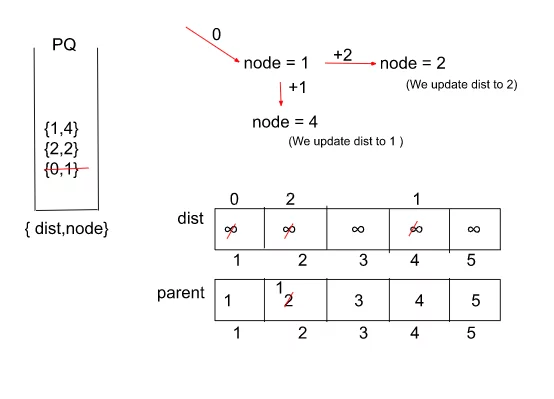

## Shortest Path in Weighted undirected graph

[Visit Problem](https://practice.geeksforgeeks.org/problems/shortest-path-in-weighted-undirected-graph/1)

**Approach :** 

We’ll be using Dijkstra’s Algorithm with a slight modification for solving this particular problem.

**The Algorithm consists of the following steps :** 

-   We start by initializing an adjacency list which will store all the adjacent nodes for a particular node along with the weights associated with them
-   Then, as a part of the initial configuration, we define a dist array to store the updated shortest distances for each node, a priority queue for storing the distance-node pairs, and a source node.
-   In addition to this, we also declare a ‘parent’ array which would store the parent node for each node and will update itself to a different parent if a shorter path from a node is found at some point in time.
-   At the start, all nodes’ parents have been set to the nodes themselves to indicate that the traversal has not yet been started.
-   For every node at the top of the queue, we pop the element out and look out for its adjacent nodes. If the current reachable distance is better than the previous distance (dis + edW < dist[adjNode]), indicated by the distance array, we update the distance and push it into the queue.
-   A node with a lower distance would be at the top of the priority queue as opposed to a node with a higher distance because we are using a min-heap
-   In addition to the previous step, we will also update the parent array to the node from where the current node came while traversing.
-   By following step 5 repeatedly until our queue becomes empty, we would get the minimum distance from the source node to all other nodes and also our parent array would be updated according to the shortest path.
-   Now, we run a loop starting from the destination node storing the node’s parent and then moving to the parent again (backtrack) till the parent[node] becomes equal to the node itself.
-   At last, we reverse the array in which the path is being stored as the path is in reverse order. Finally, we return the ‘path’ array.
-   Here’s a quick demonstration of the algorithm :

 

**Intuition :** 

The intuition behind the above problem is based on Dijkstra’s Algorithm with a combination of a little bit of memoization in order to print the shortest possible path and not just calculate the shortest distance between the source and the destination node. In order to print the path we will try to remember the node from which we came while traversing each node by Dijkstra’s Algorithm along with calculating the shortest distance. 

An array called ‘parent’ can be used for this purpose which would store the parent node for each node and will update itself if a shorter path from a node is found at some point in time. This will help us to print the path easily at the end by backtracking through the parent array till we reach the source node. 

**Complexity Analysis :** 

-   Time Complexity: `O( E * log(V) )` { for Dijkstra’s Algorithm } + O(V) { for backtracking in order to find the parent for each node } Where E = Number of edges and V = Number of Nodes.

-   Space Complexity: `O( |E| + |V| )` { for priority queue and dist array } + O( |V| ) { for storing the final path } Where E = Number of edges and V = Number of Nodes.

**References :** 

-   [Article](https://takeuforward.org/data-structure/g-35-print-shortest-path-dijkstras-algorithm/)
-   [Video](https://www.youtube.com/watch?v=rp1SMw7HSO8&list=PLgUwDviBIf0oE3gA41TKO2H5bHpPd7fzn&index=35)
