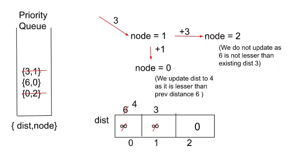
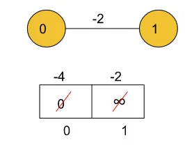

## Implementing Dijkstra Algorithm

[Visit Problem](https://practice.geeksforgeeks.org/problems/implementing-dijkstra-set-1-adjacency-matrix/1)

**Approach :** 

We’ll be using Priority Queue in this approach for finding the shortest distances from the source node to every other node through Dijkstra’s Algorithm. 

**Initial configuration :** 

-   <b>Source Node:</b> Before starting off with the Algorithm, we need to define a source node from which the shortest distances to every other node would be calculated

-   <b>Priority Queue:</b> Define a Priority Queue which would contain pairs of the type {dist, node}, where ‘dist’ indicates the currently updated value of the shortest distance from the source to the ‘node’.

-   <b>Dist Array:</b> Define a dist array initialized with a large integer number at the start indicating that the nodes are unvisited initially. This array stores the shortest distances to all the nodes from the source node

**The Algorithm consists of the following steps : :** 

-   We would be using a min-heap and a distance array of size V (where ‘V’ are the number of nodes in the graph) initialized with infinity (indicating that at present none of the nodes are reachable from the source node) and initialize the distance to source node as 0.
-   We push the source node to the queue along with its distance which is also 0.
-   For every node at the top of the queue, we pop the element out and look out for its adjacent nodes. If the current reachable distance is better than the previous distance indicated by the distance array, we update the distance and push it into the queue.  

A node with a lower distance would be at the top of the priority queue as opposed to a node with a higher distance because we are using a min-heap. By following step 3, until our queue becomes empty, we would get the minimum distance from the source node to all other nodes. We can then return the distance array. Here’s a quick demonstration of the algorithm :  

 

  

<b>Note:</b> Dijkstra’s Algorithm is not valid for negative weights or negative cycles.

We can understand that by looking at the illustration below :  
    

Here, we initially mark the source node ‘0’ as 0 and node ‘1’ as INFINITY (as it is unvisited). Now, when we start applying the above algorithm on this we notice that both the nodes are updated each time we come to them again. This is due to the negative weight of ‘-2’ which makes the total distance to the node always lesser than the previous value. Therefore, due to inaccurate results, we assume the graph to always contain positive weights while using Dijkstra’s Algorithm. 

**Intuition :** 

he above problem seems familiar to finding the shortest distance in the case of unit edge weights for undirected graphs. Hence, our first guess could be a BFS kind of approach. The only thing that we need to take care of is that for all the paths possible between a pair of nodes, we need to store the path with the minimum cost between them. That is, say we have a node that has been reached by two paths, one with a cost of 7 and another with a cost of say 9. It is obvious that the path with a cost of 7 would be more optimal than the path with a cost of 9 

**Complexity Analysis :** 

-   Time Complexity: `O( E * log(V) )`, Where` E = Number of edges and V = Number of Nodes`.
-   Space Complexity: `O(|E| + |V|)`, Where `E = Number of edges and V = Number of Nodes`.
