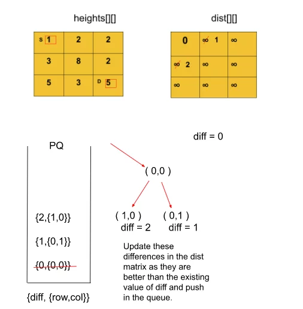

## Path With Minimum Effort

[Visit Problem](https://practice.geeksforgeeks.org/problems/path-with-minimum-effort/1)

**Approach :** 

# The Algorithm consists of the following steps :

- Start by creating a queue that stores the distance-node pairs in the form {dist,(row, col)} and a dist matrix with each cell initialized with a very large number ( to indicate that they’re unvisited initially) and the source cell marked as ‘0’.
- We push the source cell to the queue along with its distance which is also 0.
- Pop the element at the front of the queue and look out for its adjacent nodes (left, right, bottom, and top cell). Also, for each cell, check the validity of the cell if it lies within the limits of the matrix or not.
- If the current difference value of a cell from its parent is better than the previous difference indicated by the distance matrix, we update the difference in the matrix and push it into the queue along with cell coordinates.
- A cell with a lower difference value would be at the front of the queue as opposed to a node with a higher difference. The only difference between this problem and Dijkstra’s Standard problem is that there we used to update the value of the distance of a node from the source and here we update the absolute difference of a node from its parent.
- We repeat the above three steps until the queue becomes empty or until we encounter the destination node.
- Return the calculated difference and stop the algorithm from reaching the destination node. If the queue becomes empty and we don’t encounter the destination node, return ‘0’ indicating there’s no path from source to destination.
- Here’s a quick demonstration of the Algorithm’s 1st iteration ( all the further iterations would be done in a similar way ) :
  
 

**Complexity Analysis :** 

- Time-Complexity: `O( 4*N*M * log( N*M) )` { N*M are the total cells, for each of which we also check 4 adjacent nodes for the minimum effort and additional log(N*M) for insertion-deletion operations in a priority queue } , Where, N = No. of rows of the binary maze and M = No. of columns of the binary maze.
- Space-Complexity: `O( N*M ) `  { Distance matrix containing N*M cells + priority queue in the worst case containing all the nodes ( N*M) }. Where, N = No. of rows of the binary maze and M = No. of columns of the binary maze.

**References :** 

- [From Article](takeuforward.org/data-structure/g-37-path-with-minimum-effort/)
- [From Video](https://www.youtube.com/watch?v=0ytpZyiZFhA&list=PLgUwDviBIf0oE3gA41TKO2H5bHpPd7fzn&index=37)
