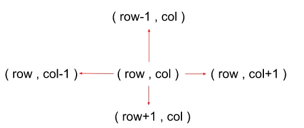
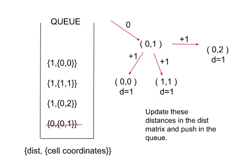
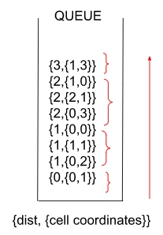

## Shortest Distance in a Binary Maze

[Visit Problem](https://practice.geeksforgeeks.org/problems/shortest-path-in-a-binary-maze-1655453161/1)

**Approach :** 
We’ll solve this problem by Dijkstra’s Algorithm using a simple queue. Since, there is no adjacency list for this particular problem we can say that the adjacent cell for a coordinate is that cell which is either on the top, bottom, left, or right of the current cell i.e, a cell can have a maximum of 4 cells adjacent to it. 

 

**The Algorithm consists of the following steps :** 

- Start by creating a queue that stores the distance-node pairs in the form {dist, coordinates of cell pair} and a dist matrix with each cell initialized with a very large number ( to indicate that they’re unvisited initially) and the source cell marked as ‘0’.
- We push the source cell to the queue along with its distance which is also 0
- Pop the element at the front of the queue and look out for its adjacent nodes (left, right, bottom, and top cell). Also, for each cell, check the validity of the cell if it lies within the limits of the matrix or not.
- If the current reachable distance to a cell from the source is better than the previous distance indicated by the distance matrix, we update the distance and push it into the queue along with cell coordinates.
- A cell with a lower distance would be at the front of the queue as opposed to a node with a higher distance. We repeat the above two steps until the queue becomes empty or until we encounter the destination node.
- Return the calculated distance and stop the algorithm from reaching the destination node. If the queue becomes empty and we don’t encounter the destination node, return ‘-1’ indicating there’s no path from source to destination.
- Here’s a quick demonstration of the algorithm :
 

  
 

**Intuition :** 

Here in this problem, instead of a graph we have a 2D binary matrix in which we have to reach a destination cell from a source cell. So, we can see that this problem is easily approachable by Dijkstra’s Algorithm. Now, here we use a queue instead of a priority queue for storing the distance-node pairs. Let’s understand through an illustration why a queue is better here:   

   

We can see clearly in the above illustration that the distances are increasing monotonically (because of constant edge weights). Since greater distance comes at the top automatically, so we do not need the priority queue as the pop operation will always pop the smaller distance which is at the front of the queue. This helps us to eliminate an additional log(N) of time needed to perform insertion-deletion operations in a priority queue.  

**Complexity Analysis :**  
- Time-Complexity: `O(4*N*M)`
- Space-Complexity: `O(N*M)`

**References :** 
- [Learn From Video](https://youtu.be/U5Mw4eyUmw4)
- [Learn From Article](https://takeuforward.org/data-structure/g-36-shortest-distance-in-a-binary-maze/)