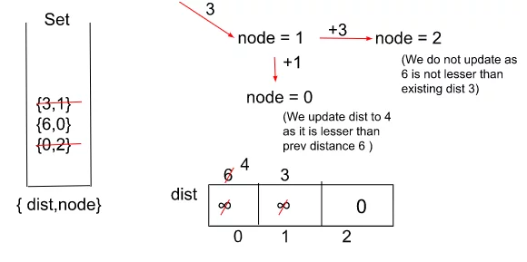

## Dijkstra’s Algorithm – Using Set

[Visit Problem](https://practice.geeksforgeeks.org/problems/implementing-dijkstra-set-1-adjacency-matrix/1)

**Approach :** 

## The Algorithm consists of the following steps :

-   We would be using a set and a distance array of size V (where ‘V’ are the number of nodes in the graph) initialized with infinity (indicating that at present none of the nodes are reachable from the source node) and initialize the distance to source node as 0
-   We push the source node to the set along with its distance which is also 0.
-   Now, we start erasing the elements from the set and look out for their adjacent nodes one by one. If the current reachable distance is better than the previous distance indicated by the distance array, we update the distance and insert it in the set
-   A node with a lower distance would be first erased from the set as opposed to a node with a higher distance. By following step 3, until our set becomes empty, we would get the minimum distance from the source node to all other nodes. We can then return the distance array.
-   The only difference between using a Priority Queue and a Set is that in a set we can check if there exists a pair with the same node but a greater distance than the current inserted node as there will be no point in keeping that node into the set if we come across a much better value than that. So, we simply delete the element with a greater distance value for the same node
-   Here’s a quick demonstration of the algorithm :
     

**Complexity Analysis :** 

-   Time-Complexity : `O(E*log(V))`
-   Space-Complexity : `O(E + V)`
