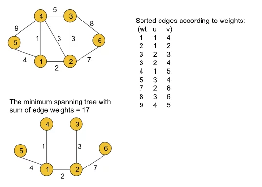

## Kruskal’s Algorithm – Minimum Spanning Tree

This problem involve about,given a weighted, undirected, and connected graph of V vertices and E edges. The task is to find the sum of weights of the edges of the Minimum Spanning Tree.

# Problem description

For better explanation, please visit [GeeksforGeeks pages](https://practice.geeksforgeeks.org/problems/minimum-spanning-tree/1)

**Approach :** 

1. First, we need to extract the edge information(if not given already) from the given adjacency list in the format of (wt, u, v) where u is the current node, v is the adjacent node and wt is the weight of the edge between node u and v and we will store the tuples in an array.
2. Then the array must be sorted in the ascending order of the weights so that while iterating we can get the edges with the minimum weights first.
3. After that, we will iterate over the edge information, and for each tuple, we will apply the following operation:
    - First, we will take the two nodes u and v from the tuple and check if the ultimate parents of both nodes are the same or not using the findUPar() function provided by the Disjoint Set data structure
    - If the ultimate parents are the same, we need not do anything to that edge as there already exists a path between the nodes and we will continue to the next tuple.
    - If the ultimate parents are different, we will add the weight of the edge to our final answer(i.e. mstWt variable used in the following code) and apply the union operation(i.e. either unionBySize(u, v) or unionByRank(u, v)) with the nodes u and v. The union operation is also provided by the Disjoint Set.
4. Finally, we will get our answer (in the mstWt variable as used in the following code) successfully.
    
    

**Complexity Analysis :** 

-   Time-Complexity: `O(N+E) + O(E logE) + O(E*4α*2)` - where N = no. of nodes and E = no. of edges. O(N+E) for extracting edge information from the adjacency list. O(E logE) for sorting the array consists of the edge tuples. Finally, we are using the disjoint set operations inside a loop. The loop will continue to E times. Inside that loop, there are two disjoint set operations like findUPar() and UnionBySize() each taking 4 and so it will result in 4*2. That is why the last term O(E*4\*2) is added.
-   Space-Complexity: `O(N) + O(N) + O(E)` - where E = no. of edges and N = no. of nodes. O(E) space is taken by the array that we are using to store the edge information. And in the disjoint set data structure, we are using two N-sized arrays i.e. a parent and a size array (as we are using unionBySize() function otherwise, a rank array of the same size if unionByRank() is used) which result in the first two terms O(N).

**References :** 

-   [Learn approach from article](https://takeuforward.org/data-structure/kruskals-algorithm-minimum-spanning-tree-g-47/)
-   [Learn approach from video](https://www.youtube.com/watch?v=DMnDM_sxVig&list=PLgUwDviBIf0oE3gA41TKO2H5bHpPd7fzn&index=47)
